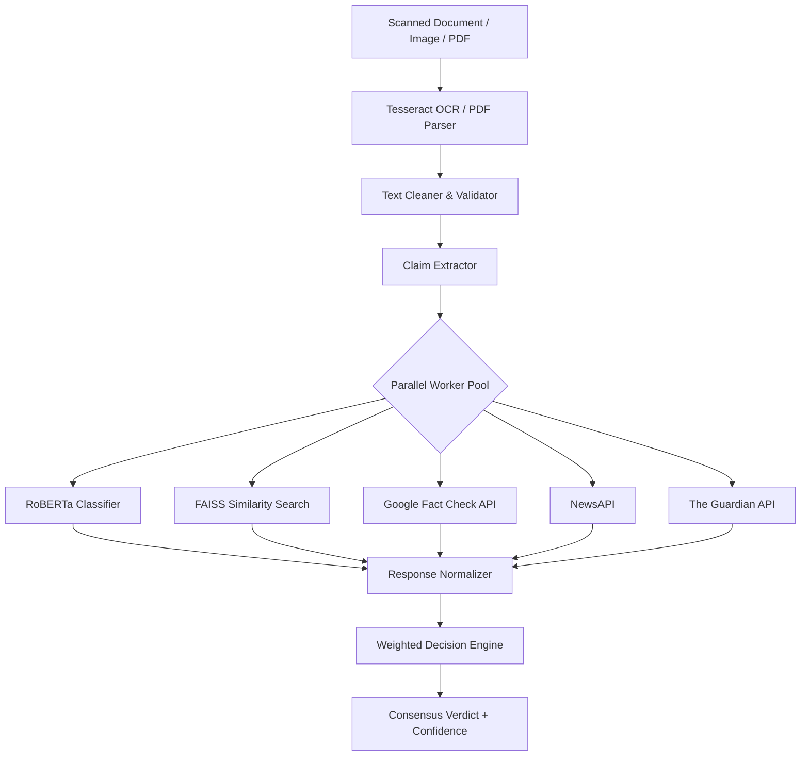

# Multi-Modal Fake News Detection Platform

An enterprise-ready, AI-driven digital evidence integrity monitoring system. This platform evaluates claims extracted from uploaded documents (PDFs and images) through multiple parallel local and remote verification channels.

---

## ⚡ Key Features

* **Multi-Modal Document Processing**: Upload scanned documents, PDFs, or images.
* **Optical Character Recognition (OCR)**: Scans and extracts text using Tesseract OCR.
* **Semantic Claim Extraction**: Automatically extracts the core claim from raw text.
* **Parallel Asynchronous Verification**:
  1. **Local Fine-Tuned RoBERTa Classifier** (Phase 1): Fine-tuned model yielding `99.96%` validation F1-score.
  2. **FAISS Semantic Similarity Search** (Phase 2): Low-latency matching against **44,898** news claims using `all-MiniLM-L6-v2` dense embeddings.
  3. **Google Fact Check API**: Real-time cross-referencing with global fact-checking databases.
  4. **NewsAPI Search**: Real-time validation against news sources.
  5. **The Guardian Content API**: Validation against trusted news publications.
* **Weighted Decision Engine**: Aggregates all model and API signals to produce a final consensus verdict (`Real`, `Fake`, or `Uncertain`) with a confidence level.
* **Premium Dashboard UI**: Responsive interface featuring glassmorphic design and real-time step progress visualization.

---

## ⚙️ Architecture & Pipeline Flow



---

## 🚀 Getting Started

### 1. Prerequisites
Ensure you have Python 3.10+ installed and Tesseract OCR setup on your system:
* **Windows Tesseract Default Path**: `C:\Program Files\Tesseract-OCR\tesseract.exe` (configurable via environment variables).

### 2. Installation
Clone the repository and install the dependencies:
```bash
pip install -r requirements.txt
```

### 3. Environment Variables
Configure your API keys in your environment (or a local `.env` file):
```bash
# Set credentials for external verification channels
export GEMINI_API_KEY="your-gemini-key"
export GOOGLE_API_KEY="your-google-api-key"
export NEWS_API_KEY="your-news-api-key"
export GUARDIAN_API_KEY="your-guardian-api-key"
```

### 4. Rebuilding the FAISS Index
Before running, build the local similarity search index from the dataset corpus:
```bash
python -m fake_news_module.similarity.index_builder
```

### 5. Running the Application
Launch the Flask development server:
```bash
python app.py
```
Open [http://localhost:5000](http://localhost:5000) in your browser.

---

## 🧪 Testing and Diagnostics
To test the API connections and check status:
```bash
python check_api_status.py
```
