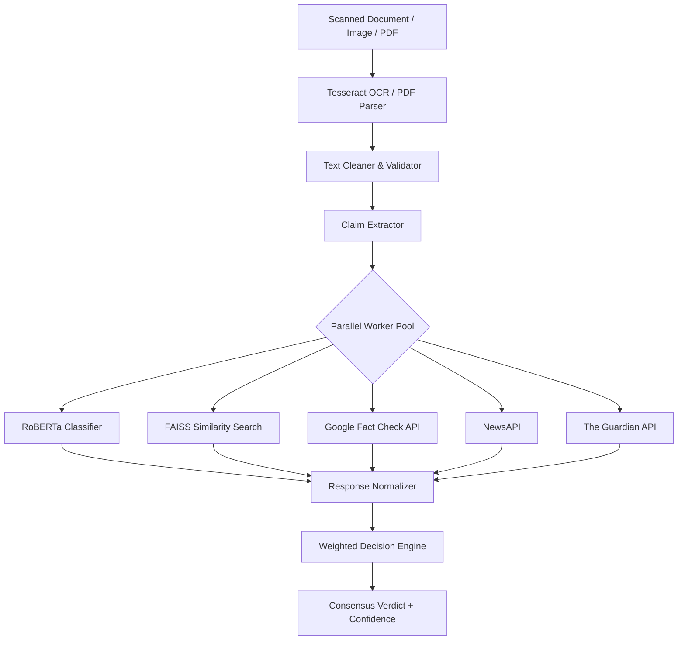

# Multi-Modal Fake News Detection Platform


An enterprise-ready, AI-driven digital evidence integrity monitoring system. This platform evaluates claims extracted from uploaded documents (PDFs and images) through multiple parallel local and remote verification channels. It combines a robust Python/Flask AI backend with a modern Next.js/TypeScript dashboard user interface.

---

## 📑 Table of Contents

- [Project Structure](#-project-structure)
- [Key Features](#-key-features)
- [Architecture & Pipeline Flow](#️-architecture--pipeline-flow)
- [Tech Stack](#-tech-stack)
- [Getting Started](#-getting-started)
- [API Endpoints](#-api-endpoints)
- [Contributing](#-contributing)
- [License](#-license)

---

## 📂 Project Structure

This repository is structured as a monorepo containing both the backend and frontend components:

* **[`backend/`](backend/README.md)**: Python/Flask API service that handles document scanning (OCR), claims extraction, and runs the parallel verification engine.
* **[`frontend/verinews-ui/`](frontend/verinews-ui/README.md)**: Next.js + TypeScript + Tailwind CSS web dashboard displaying interactive real-time analysis reports and analytics charts.

---

## ⚡ Key Features

* **Multi-Modal Document Processing**: Upload scanned documents, PDFs, or images.
* **Optical Character Recognition (OCR)**: Scans and extracts text using Tesseract OCR.
* **Semantic Claim Extraction**: Automatically extracts the core claim from raw text using AI.
* **Parallel Asynchronous Verification**:
  1. **Local Fine-Tuned RoBERTa Classifier**: Fine-tuned model yielding `99.96%` validation F1-score.
  2. **FAISS Semantic Similarity Search**: Low-latency matching against **44,898** news claims using `all-MiniLM-L6-v2` dense embeddings.
  3. **Google Fact Check API**: Real-time cross-referencing with global fact-checking databases.
  4. **NewsAPI Search**: Real-time validation against news sources.
  5. **The Guardian Content API**: Validation against trusted news publications.
* **Weighted Decision Engine**: Aggregates all model and API signals to produce a final consensus verdict (`Real`, `Fake`, or `Uncertain`) with a confidence level.
* **Premium Dashboard UI**: Responsive interface featuring glassmorphic design and real-time step progress visualization.

---

## ⚙️ Architecture & Pipeline Flow



---

## 🚀 Getting Started

To run the entire system locally, follow the steps below to set up both the backend and frontend:

### 1. Backend Setup
1. Change directory to `backend`:
   ```bash
   cd backend
   ```
2. Install Python dependencies:
   ```bash
   pip install -r requirements.txt
   ```
3. Set up your environment variables (e.g. in `.env`):
   ```bash
   GEMINI_API_KEY="your-gemini-key"
   GOOGLE_API_KEY="your-google-api-key"
   NEWS_API_KEY="your-news-api-key"
   GUARDIAN_API_KEY="your-guardian-api-key"
   ```
4. Build the local FAISS semantic similarity search index:
   ```bash
   python -m fake_news_module.similarity.index_builder
   ```
5. Run the Flask development server:
   ```bash
   python app.py
   ```
   The API will start running on [http://localhost:5000](http://localhost:5000).

### 2. Frontend Setup
1. Change directory to `frontend/verinews-ui`:
   ```bash
   cd frontend/verinews-ui
   ```
2. Install npm dependencies:
   ```bash
   npm install
   ```
3. Start the Next.js development server:
   ```bash
   npm run dev
   ```
   Open [http://localhost:3000](http://localhost:3000) in your browser to view the application.

---

## 📄 License
This project is licensed under the MIT License - see the [LICENSE](LICENSE) file for details.
